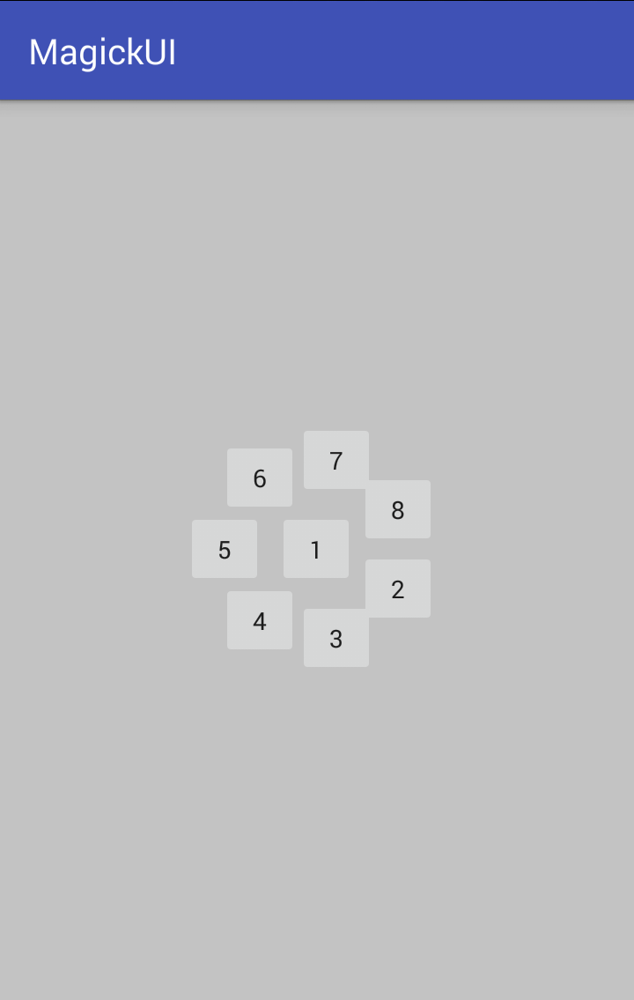
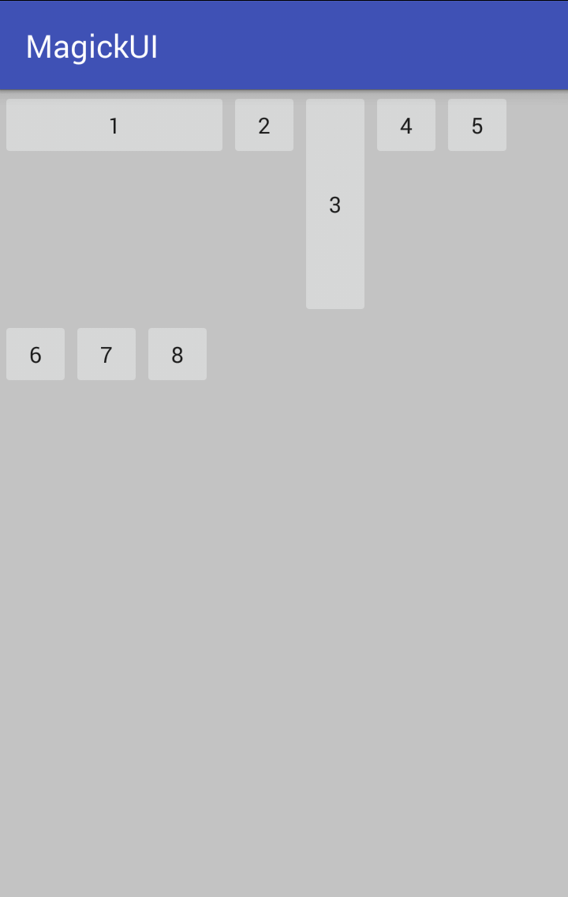
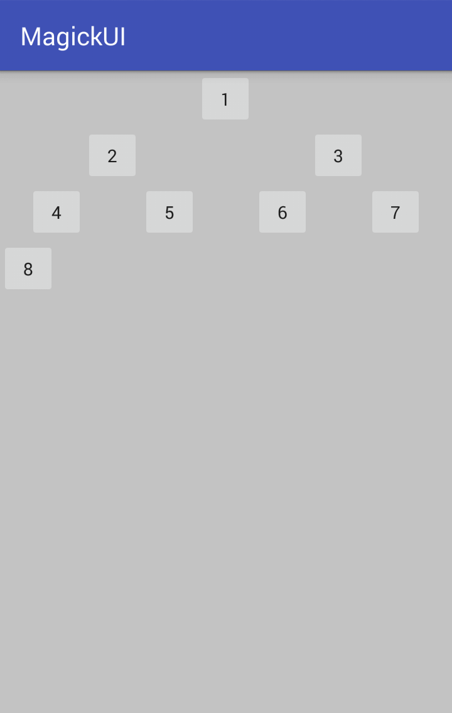

# MagikUI
This library is a collection of some of the amazing features of **Android**. It contains some custom layouts, animators and decorators. One can use this library in their android project and easily bring some amazing beautification to their project.  

This library contains some custom layouts like **CircularLayout**, **ParagraphLayout** and **TreeLayout**, which are specially designed for implementing out of the box ideas.

It is very easy to use this library in your android project. Just add `compile 'com.tarunisrani.magikui:magikui:1.0.1'` in your project's **build.gradle** file.

### Usages

#### CircularLayout
CircularLayout is developed for scenarios where developer needs to arrange ui elements in a circular arrangement.

By Default first element is added to the center. 

##### How to use:
    <com.tarunisrani.magikui.magiklayouts.CircularLayout
            android:id="@+id/testLayout"
            android:orientation="vertical"
            android:layout_centerInParent="true"
            android:layout_width="wrap_content"
            android:layout_height="wrap_content">
            <Button
                android:id="@+id/centerButton"
                android:layout_width="45dp"
                android:layout_height="45dp"
                android:visibility="visible"
                android:text="1" />
            <Button
                android:layout_width="45dp"
                android:layout_height="45dp"
                android:text="2"/>
            <Button
                android:layout_width="45dp"
                android:layout_height="45dp"
                android:text="3"/>
            <Button
                android:layout_width="45dp"
                android:layout_height="45dp"
                android:text="4"/>
            <Button
                android:layout_width="45dp"
                android:layout_height="45dp"
                android:gravity="center"
                android:text="5"/>
            <Button
                android:layout_width="45dp"
                android:layout_height="45dp"
                android:text="6"/>
            <Button
                android:layout_width="45dp"
                android:layout_height="45dp"
                android:text="7"/>
            <Button
                android:layout_width="45dp"
                android:layout_height="45dp"
                android:gravity="center"
                android:text="8"/>
        </com.tarunisrani.magikui.magiklayouts.CircularLayout>
    

    
#### ParagraphLayout
ParagraphLayout is developed for scenarios where ui elements are required to be arranged in linear fashion but also has to be adjusted vertically so as to be able to fit in limited bounds. It is similar to wrapping of text in **EditText** when content if more then the width. 

##### How to use:
    <com.tarunisrani.magikui.magiklayouts.ParagraphLayout
            android:id="@+id/testLayout"
            android:orientation="vertical"
            android:layout_width="wrap_content"
            android:layout_height="wrap_content">
            <Button
                android:id="@+id/centerButton"
                android:layout_width="145dp"
                android:layout_height="45dp"
                android:visibility="visible"
                android:text="1" />
            <Button
                android:layout_width="45dp"
                android:layout_height="45dp"
                android:text="2"/>
            <Button
                android:layout_width="45dp"
                android:layout_height="145dp"
                android:text="3"/>
            <Button
                android:layout_width="45dp"
                android:layout_height="45dp"
                android:text="4"/>
            <Button
                android:layout_width="45dp"
                android:layout_height="45dp"
                android:gravity="center"
                android:text="5"/>
            <Button
                android:layout_width="45dp"
                android:layout_height="45dp"
                android:text="6"/>
            <Button
                android:layout_width="45dp"
                android:layout_height="45dp"
                android:text="7"/>
            <Button
                android:layout_width="45dp"
                android:layout_height="45dp"
                android:gravity="center"
                android:text="8"/>
        </com.tarunisrani.magikui.magiklayouts.ParagraphLayout>
    

#### TreeLayout
TreeLayout is developed for scenarios where ui elements are required to be arranged tree fashion or in hierarchy. 

##### How to use:
    <com.tarunisrani.magikui.magiklayouts.TreeLayout
            android:id="@+id/testLayout"
            android:orientation="vertical"
            android:layout_centerInParent="true"
            android:layout_width="wrap_content"
            android:layout_height="wrap_content">
    
            <Button
                android:id="@+id/centerButton"
                android:layout_width="45dp"
                android:layout_height="45dp"
                android:visibility="visible"
                android:text="1" />
            <Button
                android:layout_width="45dp"
                android:layout_height="45dp"
                android:text="2"/>
            <Button
                android:layout_width="45dp"
                android:layout_height="45dp"
                android:text="3"/>
            <Button
                android:layout_width="45dp"
                android:layout_height="45dp"
                android:text="4"/>
            <Button
                android:layout_width="45dp"
                android:layout_height="45dp"
                android:gravity="center"
                android:text="5"/>
            <Button
                android:layout_width="45dp"
                android:layout_height="45dp"
                android:text="6"/>
            <Button
                android:layout_width="45dp"
                android:layout_height="45dp"
                android:text="7"/>
            <Button
                android:layout_width="45dp"
                android:layout_height="45dp"
                android:gravity="center"
                android:text="8"/>
    
        </com.tarunisrani.magikui.magiklayouts.TreeLayout>

